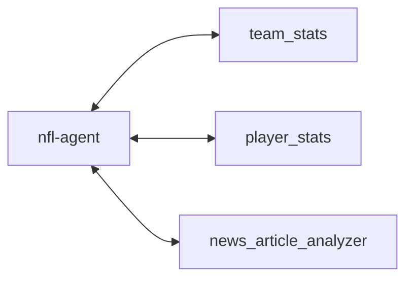

# NFL Agent

An intelligent agent for fetching and analyzing NFL data from ESPN APIs.

## Quick Start

Install the dependencies. I use uv for package management.

```bash
uv sync
```

save your .env file in the root of the project

```bash
OPENAI_API_KEY=sk-proj-xxxxxxxxxxxxxxxxxxxxxxxxxxxxxxxxxxxxxxxxxxxxxxxx
```

run the agent

```bash
uv run nfl-agent
```

## Design

given these set of tools, predict the probability of each team winning the matchup.


## Agent


The root agent (nfl-agent) is a simple agent that uses the tools to predict the probability of each team winning the matchup.
It has access to tools to gather information about the teams and players, and news about the teams.

It outputs the probability of each team winning the matchup.


## Tools and Sub-Agents

### team_stats

given the team name, fetch the stats for the team, player information key players on the team, and any injuries to players

### player_stats

given the player name, fetch the stats for the player

### news_article_analyzer

given the team name, fetch the latest news articles about the team

this is actually a workflow, that can be called as a tool:


## Evaluation Experiments

there are 3 prompts used in the system:

1. article relevance classification prompt: used to select the most relevant article from a list of articles
2. article summary prompt: used to summarize the article content
3. nfl_agent prompt: used to predict the probability of each team winning the matchup

Before writing the prompts, I made sure to gather the data and experimental setup needed to evaluate the prompt. These experiments are stored in the `experiments` folder.

