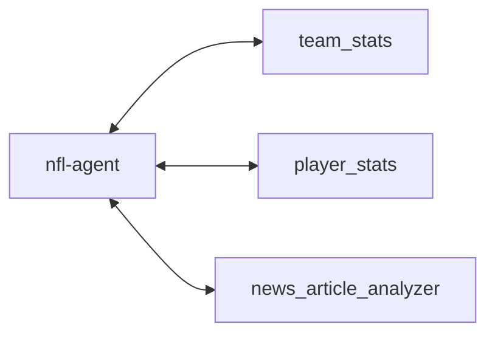
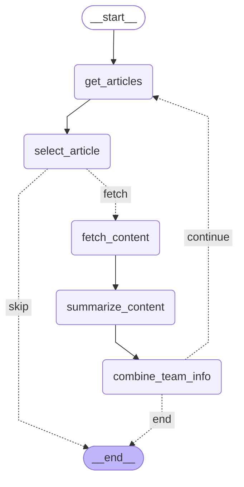

# NFL Agent

An intelligent agent for fetching and analyzing NFL data from ESPN APIs.

## Abstract

A toy project to demonstrait a design process for building a multi-agent system with a focus on evalutation techniques for agentic systems. I created a simple services that was able to predict weekly NFL matchups by iterratively reading news articles and stats from publically avalible APIs. I also demonstrated how I would evaluate the LLM's correctness via human-annotations and LLM-as-a-Judge. Although tested on a limited dataset, my model was able to predict the correct outcome for 81.2% of the games (compared to a random baseline of 50.0% and a sportsbook baseline of 62.5%). 

## Quick Start

Install the dependencies. I use uv for package management.

```bash
uv sync
```

save your .env file in the root of the project

```bash
OPENAI_API_KEY=sk-proj-xxxxxxxxxxxxxxxxxxxxxxxxxxxxxxxxxxxxxxxxxxxxxxxx
```

run the agent

```bash
uv run nfl-agent
```

## Design

given these set of tools, predict the probability of each team winning the matchup.


## Agent


The root agent (nfl-agent) is a simple agent that uses the tools to predict the probability of each team winning the matchup.
It has access to tools to gather information about the teams and players, and news about the teams.

It outputs the probability of each team winning the matchup.


## Tools and Sub-Agents

### team_stats

given the team name, fetch the stats for the team, player information key players on the team, and any injuries to players

### player_stats

given the player name, fetch the stats for the player

### news_article_analyzer

given the team name, fetch the latest news articles about the team

this is actually a workflow, that can be called as a tool:




## Evaluation Experiments

there are 3 prompts used in the system:

1. article relevance classification prompt: used to select the most relevant article from a list of articles
2. article summary prompt: used to summarize the article content
3. nfl_agent prompt: used to predict the probability of each team winning the matchup

Before writing the prompts, I made sure to gather the data and experimental setup needed to evaluate the prompt. These experiments are stored in the `experiments` folder.

## Results

## Relevance Classification Evaluation

Given a list of articles, the LLM is asked to select the most relevant article to be used to build a prediction for the next game.

Human annotation was then used to label ground truth data.

The LLM is 1.2x more likely to select the most relevant article than a random baseline.


|section |total_trials|total_successes|success_rate|random_baseline|lift_over_random|
|--------|------------|---------------|------------|---------------|----------------|
|Prompt 1|60          |52             |0.87        |0.38           |1.28            |
|Prompt 2|60          |54             |0.90        |0.41           |1.20            |


## Article Summary Evaluation

Given an article, the LLM is asked to summarize the article content into different categories:

- coaching_summary
- injuries
- strengths
- problem_areas
- relevant_players

Human annotation again tried to be leveraged, however the task was too tedious to be done manually.

Instead, I used the LLM as a judge to evaluate the accuracy of the summary.

The LLM-as-a-judge was asked to evaluate the summary on 3 dimensions:

- accuracy: did we get everything right?
- completeness: is there something we missed?
- relevance: is this useful in making a prediction for the next game?

### Overall Average Scores

| Metric | Score |
|--------|-------|
| Accuracy | 0.9597 |
| Completeness | 0.1562 |
| Relevancy | 0.9047 |


### Accuracy by Category

| Category | Accuracy | Correct Facts | Total Facts |
|----------|----------|--------------|-------------|
| coaching_summary | 0.8000 | 8 | 10 |
| injuries | 1.0000 | 6 | 6 |
| problem_areas | 1.0000 | 17 | 17 |
| relevant_players | 0.9444 | 34 | 36 |
| strengths | 0.9583 | 23 | 24 |

### Relevancy by Category

| Category | Relevancy | Relevant Facts | Total Facts |
|----------|-----------|----------------|-------------|
| coaching_summary | 0.7727 | 17 | 22 |
| injuries | 1.0000 | 14 | 14 |
| problem_areas | 0.9302 | 40 | 43 |
| relevant_players | 1.0000 | 90 | 90 |
| strengths | 0.7867 | 59 | 75 |


## Agent Evaluation

The agent was evaluated on the accuracy of the prediction for the next game.


Experiment details:
- generate predictions for all 16 games for week 18
- get the sports betting lines (moneyline for implied probability)
- after Monday, get the game results

## Metrics

| Metric | Model | Sportsbook | Random |
|--------|-------|------------|--------|
| Accuracy | 81.2% | 62.5% | 50.0% |
| Brier Score | 0.1726 | 0.1989 | 0.2500 |
| BSS vs Random | +31.0% | +20.4% | 0.0% |
| Games Evaluated | 16 | 16 | 16 |


### Agent Evaluation Summary

- **Model correct, Sportsbook incorrect**: 3 games
- **Sportsbook correct, Model incorrect**: 0 games
- **Model incorrect**: 3 games
- **Sportsbook incorrect**: 6 games
- **Both correct**: 10 games
- **Both incorrect**: 3 games

### Game-by-Game Details

| Game | Model Prob | Sportsbook Prob | Outcome | Score | Prediction Result |
|------|------------|-----------------|---------|-------|-------------------|
| Indianapolis Colts @ Houston Texans | 68.00% | 80.43% | Home Win | 30-38 | Both ✓ |
| Green Bay Packers @ Minnesota Vikings | 62.00% | 84.65% | Home Win | 3-16 | Both ✓ |
| Carolina Panthers @ Tampa Bay Buccaneers | 68.00% | 58.30% | Home Win | 14-16 | Both ✓ |
| Arizona Cardinals @ Los Angeles Rams | 68.00% | 89.34% | Home Win | 20-37 | Both ✓ |
| Seattle Seahawks @ San Francisco 49ers | 42.00% | 41.70% | Away Win | 13-3 | Both ✓ |
| Baltimore Ravens @ Pittsburgh Steelers | 55.00% | 35.53% | Home Win | 24-26 | **Model ✓, Sportsbook ✗** |
| Kansas City Chiefs @ Las Vegas Raiders | 80.00% | 34.25% | Home Win | 12-14 | **Model ✓, Sportsbook ✗** |
| Detroit Lions @ Chicago Bears | 58.00% | 60.38% | Away Win | 19-16 | **Both ✗** |
| Miami Dolphins @ New England Patriots | 68.00% | 89.34% | Home Win | 10-38 | Both ✓ |
| New Orleans Saints @ Atlanta Falcons | 62.00% | 63.09% | Home Win | 17-19 | Both ✓ |
| Washington Commanders @ Philadelphia Eagles | 80.00% | 61.64% | Away Win | 24-17 | **Both ✗** |
| New York Jets @ Buffalo Bills | 78.00% | 85.25% | Home Win | 8-35 | Both ✓ |
| Los Angeles Chargers @ Denver Broncos | 72.00% | 90.83% | Home Win | 3-19 | Both ✓ |
| Tennessee Titans @ Jacksonville Jaguars | 72.00% | 85.79% | Home Win | 7-41 | Both ✓ |
| Dallas Cowboys @ New York Giants | 80.00% | 40.04% | Home Win | 17-34 | **Model ✓, Sportsbook ✗** |
| Cleveland Browns @ Cincinnati Bengals | 65.00% | 78.19% | Away Win | 20-18 | **Both ✗** |

*probabilities are for home team
