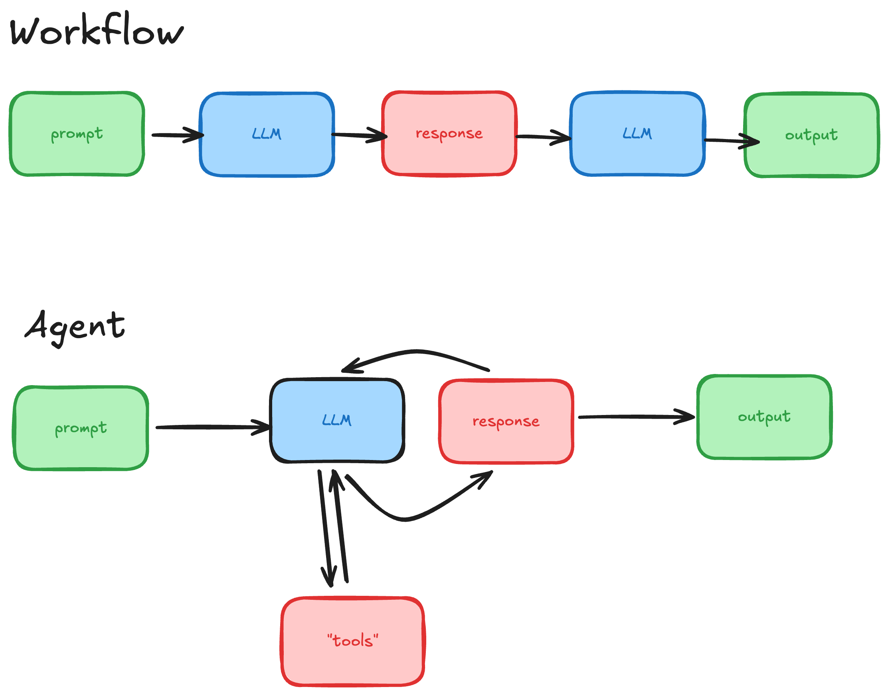

# Brainstorming

---
layout: two-cols-header
---

# Brainstorming 

::left::

## Workflow vs. Agent

::right ::

## Checklist: "should this be an agent?":
-  complex (can't be a workflow)
- valuable 
- do-able (all parts can be completed with the context provided)
- requires text-based reasoning

--- 

# Brainstorming

|                   |complex (can't be a workflow)|valuable|do-able                 |requires text-based reasoning|
|---------------    |-------|--------|------------------------|-----------------|
|Apt scheduler      |No     |No      |Yes                     |Yes              |
|Stock trading      |Yes    |Yes     |Yes                     |No               |
|Patient summary    |Yes    |Yes     |No (not enough data)    |No               |
|Sports Analytics   |Yes    |Yes     |Yes                     |Yes              |

- Lesson: many projects can be broken down into workflow
- Lesson: right tool for the right job 

