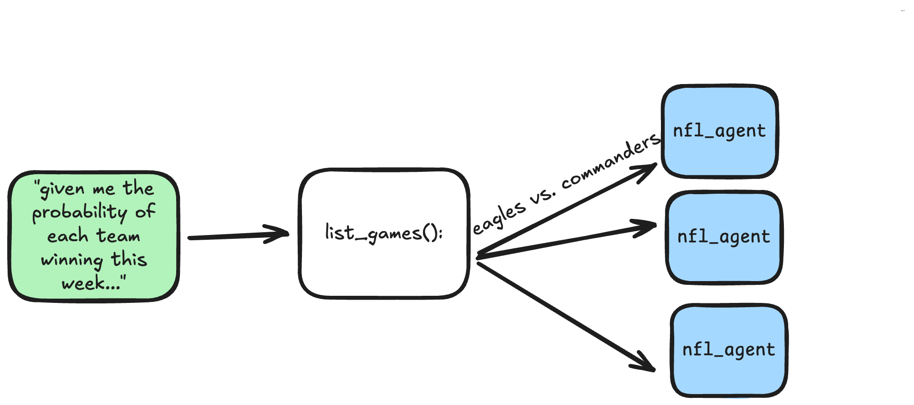
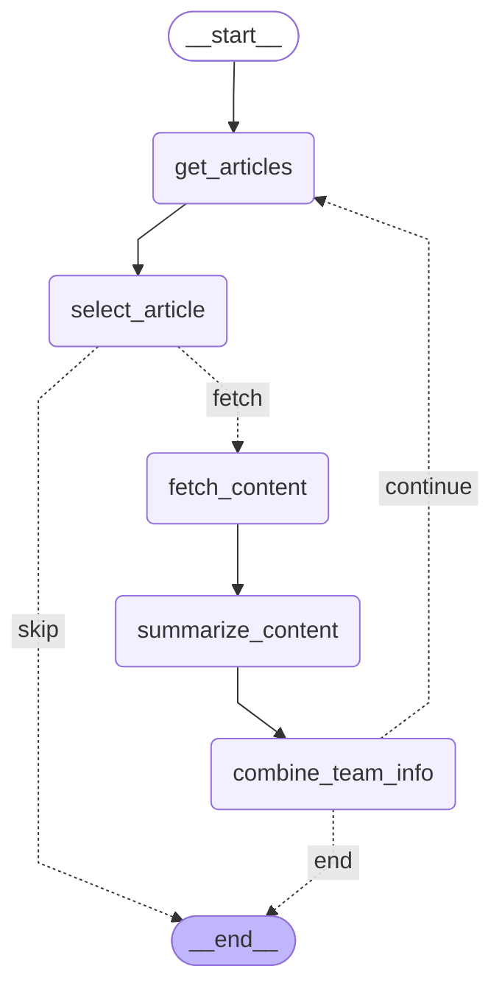

# Design

---

# Design

## Define the Problem:

For the upcoming week in the NFL season, give me the probability of each team winning their matchup.




---
layout: image-right

# the image source
image: ../components/tools.png

# a custom class name to the content
class: my-cool-content-on-the-right
---

# Design

## Define the tools

- `team_stats`: list of stats for a team
- `player_stats`: list of stats for a player
- `news_article_analyzer`: list of insights from recent news articles about a team
- `play-by-play_analyzer` (out of scope)

- Lessons Learned: sub-agents are for managing context not role-playing


---
class: text-sm
---

# Design 
## stats lookup tool   

- no LLM API calls in this tool
- use ESPN public API
- Used Cursor a lot to understsand schemas and map to fields needed

```python

class Team(BaseModel):
    name: str
    abbreviation: str
    # pick the most important players for each team
    qb_player: QbPlayer
    skill_stats: List[SkillPlayer]
    def_players: List[DefPlayer]
    injured_players: List[InjuredPlayer]

class Player(BaseModel):
    name: str
    team: str
    position: str
    position_class: Literal["QB", "SKILL", "OL", "DEF"]
    height: int
    weight: float
    age: int
    ...
```


---
layout: two-cols-header
zoom: 0.70

---


# Design 

## news article analyzer tool   

::left::

Define the problem:

```markdown
1. Use the ESPN search to find insightful articles about the upcoming match. 
2. Select the most use article to read next.
3. Fetch and read the article content.
4. Summarize the article content.
5. Combine the article content with the team info.
```

- Lessons learned: this is a _workflow_ not a subagent
- for _workflows_ we use langgraph (DAG orchestration system)


::right::



