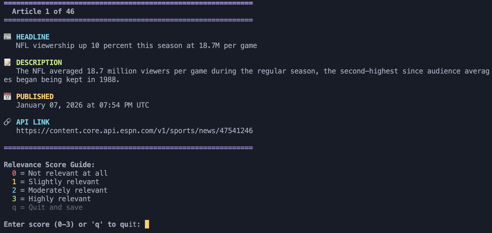
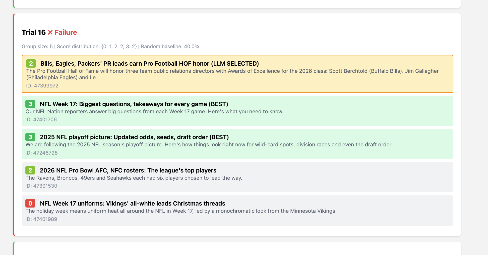
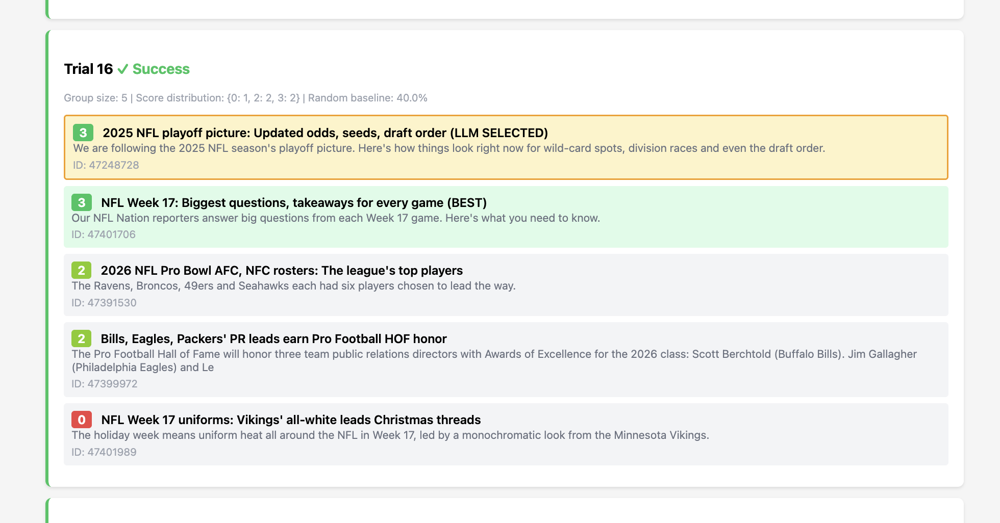

# Experiments

---

# E1: Relevance Classification Evaluation

## Goal

- given a list of article titles and descriptions, the llm is asked to choose the most useful article to be used to build a prediction for the next game

## Evaluation Dataset
- list of 46 articles for a single team (Philadelphia Eagles)

## Evaluation Techinque

- measure top-1 accuracy for an LLM to choose the "best" article (human-labeled dataset ranked from 0-3) from a stratified dataset

---

# E1: Relevance Classification Evaluation

## Annotation Process

- Created a quick CLI to allow human evaluation
- rate on a scale of 0-3 how "relevant" an article would be



---
text: text-sm
---

# E1: Relevance Classification Evaluation
## Experiment Details
- Monte Carlo trial generation with constraint-based sampling

- each trial presents the LLM with a group of articles and asks it to select the single most relevant one
- Top-1 success metric: a trial succeeds if the LLM selects any article with a score of 3, allowing multiple correct answers per trial group




---

# E1: Relevance Classification Evaluation
## Prompt 2 

- added more instruction to balance the focus on players and predictions




---

# E1: Relevance Classification Evaluation
## Experiment Results 


|section |total_trials|total_successes|success_rate|random_baseline|lift_over_random|
|--------|------------|---------------|------------|---------------|----------------|
|Prompt 1|60          |52             |0.87        |0.38           |1.28            |
|Prompt 2|60          |54             |0.90        |0.38           |1.36            |

(n=10)

---
zoom: 0.8
---

# E2: Article Summary Evaluation

## Goal

- given an ESPN article text, pull out the relevant information to be used to build a prediction for the next game

```python
class TeamInfo(BaseModel):
    name: str
    coaching_summary: Optional[str] = Field(None, description="Summary of the team's coaching strategy")
    injuries: Optional[List[str]] = Field(None, description="List of injuries for the team")
    strengths: Optional[List[str]] = Field(None, description="List of strengths for the team")
    problem_areas: Optional[List[str]] = Field(None, description="List of problem areas for the team")
    relevant_players: Optional[List[str]] = Field(None, description="List of relevant players for the team")

```


## Evaluation Dataset
- 46 articles for a single team (Philadelphia Eagles)

## Eval Strategy
- accuracy / completeness / relevence scores using rubric-based LLM-as-a-Judge

---

# E2: Article Summary Evaluation

## Evaluation Tasks

- Accuracy: did we get everything right?
- Completeness: is there something we missed?
- Relevance: is this useful in making a prediction for the next game?

---

# E2: Article Summary Evaluation

## Human Annotation Setup

Example:
```markdown
- Category: Weaknesses
- Fact: "Linebacker rotation and depth may be tested if Nakobe Dean misses time due to hamstring injury"
- Article: "The Eagles' defense rose to the occasion Sunday, delivering a goal-line stand in the second half and surviving a two-point conversion..."
```

## Human Annotation Results
- FAIL: tried to label this on my own, very tedious
- LLM as a judge: exported reasoning to try to see if it missed anything
- Lessons learned: need to do correlation analysis to ensure that LLM-as-a-judge gives the correct signal to human preference

---


# E2: Article Summary Evaluation

## Overall Average Scores

| Metric | Score |
|--------|-------|
| Accuracy | 0.9597 |
| Completeness | 0.1562 |
| Relevancy | 0.9047 |

---

# E2: Article Summary Evaluation

## Accuracy by Category

| Category | Accuracy | Correct Facts | Total Facts |
|----------|----------|--------------|-------------|
| coaching_summary | 0.8000 | 8 | 10 |
| injuries | 1.0000 | 6 | 6 |
| problem_areas | 1.0000 | 17 | 17 |
| relevant_players | 0.9444 | 34 | 36 |
| strengths | 0.9583 | 23 | 24 |

---

# E2: Article Summary Evaluation
## Relevancy by Category

| Category | Relevancy | Relevant Facts | Total Facts |
|----------|-----------|----------------|-------------|
| coaching_summary | 0.7727 | 17 | 22 |
| injuries | 1.0000 | 14 | 14 |
| problem_areas | 0.9302 | 40 | 43 |
| relevant_players | 1.0000 | 90 | 90 |
| strengths | 0.7867 | 59 | 75 |

---

# E3: Agent Evaluation

## Goal
- For the upcoming week in the NFL season, give me the probability of each team winning their matchup.


## Experiment Details

- generate predictions for all 16 games for week 18 (model ouputs probability of home-team winning)
- get the sports betting lines (moneyline for implied probability)
- after Monday, get the game results

## Eval Strategy

- for each game, evaluate win-probability by computing Brier scores against actual outcomes for the model, sportsbook, and random baseline.

---
text: text-sm
zoom: 0.7
---

# E3: Agent Evaluation 

**Week 18** - 16 games evaluated

## Metrics

| Metric | Model | Sportsbook | Random |
|--------|-------|------------|--------|
| Accuracy | 81.2% | 62.5% | 50.0% |
| Brier Score | 0.1726 | 0.1989 | 0.2500 |
| BSS vs Random | +31.0% | +20.4% | 0.0% |
| Games Evaluated | 16 | 16 | 16 |

## Agent Evaluation Summary

- **Model correct, Sportsbook incorrect**: 3 games
- **Sportsbook correct, Model incorrect**: 0 games
- **Model incorrect**: 3 games
- **Sportsbook incorrect**: 6 games
- **Both correct**: 10 games
- **Both incorrect**: 3 games


---
text: text-sm
zoom: 0.50
---

## Game-by-Game Details

| Game | Model Prob | Sportsbook Prob | Outcome | Score | Prediction Result |
|------|------------|-----------------|---------|-------|-------------------|
| Indianapolis Colts @ Houston Texans | 68.00% | 80.43% | Home Win | 30-38 | Both ✓ |
| Green Bay Packers @ Minnesota Vikings | 62.00% | 84.65% | Home Win | 3-16 | Both ✓ |
| Carolina Panthers @ Tampa Bay Buccaneers | 68.00% | 58.30% | Home Win | 14-16 | Both ✓ |
| Arizona Cardinals @ Los Angeles Rams | 68.00% | 89.34% | Home Win | 20-37 | Both ✓ |
| Seattle Seahawks @ San Francisco 49ers | 42.00% | 41.70% | Away Win | 13-3 | Both ✓ |
| Baltimore Ravens @ Pittsburgh Steelers | 55.00% | 35.53% | Home Win | 24-26 | **Model ✓, Sportsbook ✗** |
| Kansas City Chiefs @ Las Vegas Raiders | 80.00% | 34.25% | Home Win | 12-14 | **Model ✓, Sportsbook ✗** |
| Detroit Lions @ Chicago Bears | 58.00% | 60.38% | Away Win | 19-16 | **Both ✗** |
| Miami Dolphins @ New England Patriots | 68.00% | 89.34% | Home Win | 10-38 | Both ✓ |
| New Orleans Saints @ Atlanta Falcons | 62.00% | 63.09% | Home Win | 17-19 | Both ✓ |
| Washington Commanders @ Philadelphia Eagles | 80.00% | 61.64% | Away Win | 24-17 | **Both ✗** |
| New York Jets @ Buffalo Bills | 78.00% | 85.25% | Home Win | 8-35 | Both ✓ |
| Los Angeles Chargers @ Denver Broncos | 72.00% | 90.83% | Home Win | 3-19 | Both ✓ |
| Tennessee Titans @ Jacksonville Jaguars | 72.00% | 85.79% | Home Win | 7-41 | Both ✓ |
| Dallas Cowboys @ New York Giants | 80.00% | 40.04% | Home Win | 17-34 | **Model ✓, Sportsbook ✗** |
| Cleveland Browns @ Cincinnati Bengals | 65.00% | 78.19% | Away Win | 20-18 | **Both ✗** |

*probabilities are for home team


--- 
layout: section
---

# Next Steps & Lessons Learned

---

## Next Steps
- offline evals on 2024 data (hard to get news articles from that long ago)
- analysis on the traces where the model predicted correctly against the spread

## Lessons Learned

- before writing a prompt, have an eval dataset and pipeline
- workflow > agent (right tool for the job)
- stay out of the "dumb zone"
